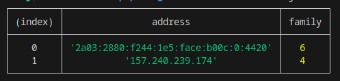
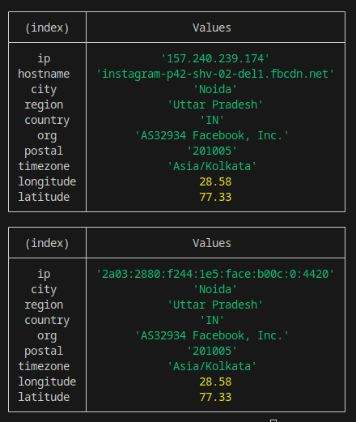
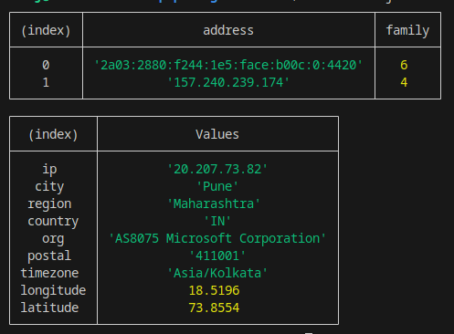

# domainprobe
The Domain Info Extractor is a Node.js package that allows users to provide a domain name and retrieve detailed information such as IP address and location.

## Installation:
- You can install the package using npm:
```bash
    npm install domainprobe
```

## Features:
- you can get ip address of domain name (e.g- 'https://github.com/)
- you can get information regarding domain name (e.g- location , hostname, longitude,latitude etc)
- you can get hostname using ip address.
- you can get infomation directly using ip address. (e.g- location,hostname,etc)
- you can get exact location using latitude and longitude


## Usage:
- ***Importing the Package**
```bash
    const info = require('domainprobe');

```

## Functions available (1):
- **get_ip('domain_name',callback)**
- This function retrieves the IP address of a domain.
- ***Example***-

```bash

    info.get_ip('https://github.com/', (err, address) => {
        if(err) {
            console.error(err);
        } else {
            console.log(address);
        }
    });


```

- ***Output***-
```js
    [ { address: '20.207.73.82', family: 4 } ]

```

## Function available (2):
- **data_extract(domain_name, callback)**
- This function provides detailed information about a domain, including its IP address, city, region, country, organization, postal code, timezone, longitude, and latitude.
- ***Example***-


```bash

    info.data_extract('https://github.com/', (err, data) => {
        if(err) {
               console.error(err);
        } else {
            console.log(data);
        }
    });


```
- ***Output***-
```js
    {
      ip: '20.207.73.82',
      city: 'Pune',
      region: 'Maharashtra',
      country: 'IN',
      org: 'AS8075 Microsoft Corporation',
      postal: '411001',
      timezone: 'Asia/Kolkata',
      longitude: 18.5196,
      latitude: 73.8554
    }      

```

## Function available (3):
- **get_hostname(ip_address,callback)**
- this function is used to get hostname by using the ip address.

- ***Example***-


```bash

    info.get_hostname('157.240.198.174', (err, data) => {
        if(err) {
               console.error(err);
        } else {

            console.log(data);
        }
    });


```

- ***Output***
```js
    Hostnames for 157.240.198.174:
    [ 'instagram-p42-shv-01-del1.fbcdn.net' ]
```


## Function available (4):
- **data_extract_ip(ip_address,callback)**
- this function is used to get information (detailed) of an ip address.
- ***Example***-


```bash

    info.data_extract_ip('157.240.198.174', (err, data) => {
        if(err) {
               console.error(err);
        } else {

            console.log(data);
        }
    });


```

- ***Output**-
```js
    {
      ip: '157.240.198.174',
      hostname: 'instagram-p42-shv-01-del1.fbcdn.net',
      city: 'Noida',
      region: 'Uttar Pradesh',
      country: 'IN',
      org: 'AS32934 Facebook, Inc.',
      postal: '201005',
      timezone: 'Asia/Kolkata',
      longitude: 28.58,
      latitude: 77.33
    }

```

## Function available (5):
- **exact_location(longitude,latitude,callback)**
- this function is used for getting exact location from the latitude and longitude. you can get lat and long from above functions 'data_extract' and 'data_extract_ip'.
- ***Example***-

```bash
    info.exact_location(28.58,77.33, (err, result) => {
    if (err) {
      console.error('Error:', err);
    } else {
      console.log('Result:', result);
    }
  });

```

- ***Output***-
```js
    Result: {
    suburb: 'Sector 10',
    city: 'Noida',
    town: 'Dadri',
    state_district: 'Gautam Buddha Nagar District',
    state: 'Uttar Pradesh',
    'ISO3166-2-lvl4': 'IN-UP',
    postcode: '201301',
    country: 'India',
    country_code: 'in'
    }

```


## Example 1:
- ***Code***-
```bash
    const info = require('domainprobe');
    info.get_ip('https://www.instagram.com/', (err, address) => {
        if(err) {
            console.error(err);
        } else {
            console.table(address);
        }
    });


```

- ***Output***-



## Example 2:

- ***Code***-
```bash
    const info = require('domainprobe');
    info.data_extract('https://www.instagram.com/', (err, address) => {
        if(err) {
            console.error(err);
        } else {
            console.table(address);
        }
    });
```

- ***Output***-


## Example 3:
- ***Code***-
```bash
    const info = require('domainprobe');


    info.get_ip('https://www.instagram.com/', (err, address) => {
        if(err) {
            console.error(err);
        } else {
            console.table(address);
        }
    });

    info.data_extract('https://github.com/', (err, address) => {
        if(err) {
            console.error(err);
        } else {
            console.table(address);
        }
    });


```
- ***Output***-
